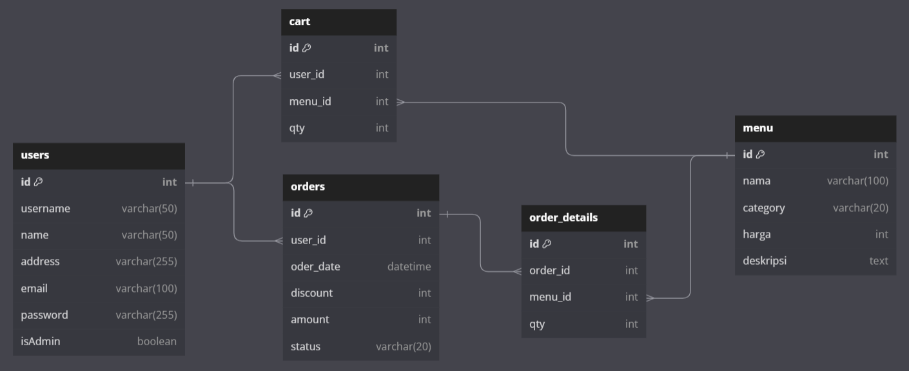

# ftgo-p1-MilestoneProject


# Klepon Coffee Shop Program

## Deskripsi Singkat
Program ini adalah aplikasi pemesanan untuk Klepon Coffee Shop. Pengguna dapat login sebagai admin atau pelanggan, dan melakukan berbagai operasi terkait pemesanan dan manajemen.

## ERD Program
image[]

# Struktur Tabel dan Data - Klepon Coffee Shop Program

Berikut adalah penjelasan tentang struktur tabel dan data yang digunakan dalam program Klepon Coffee Shop.

## Tabel "users"

- **id** (INT): Kunci utama.
- **username** (VARCHAR(20)): Nama pengguna unik.
- **name** (VARCHAR(50)): Nama pengguna.
- **address** (TEXT): Alamat pengguna.
- **email** (VARCHAR(100)): Alamat email pengguna.
- **password** (VARCHAR(255)): Kata sandi pengguna.
- **isAdmin** (BOOLEAN): Menunjukkan apakah pengguna adalah admin (DEFAULT: FALSE).

## Tabel "menu"

- **id** (INT): Kunci utama.
- **nama** (VARCHAR(100)): Nama menu.
- **harga** (INT): Harga menu.
- **deskripsi** (TEXT): Deskripsi menu.
- **category** (VARCHAR(20)): Kategori menu (misalnya, "Food" atau "Drink").
- **status** (ENUM): Menunjukkan status ketersediaan menu (DEFAULT: "available").

## Tabel "orders"

- **id** (INT): Kunci utama.
- **user_id** (INT): Mengacu pada pengguna yang membuat pesanan.
- **order_date** (DATETIME): Tanggal pesanan.
- **discount** (INT): Diskon pada pesanan.
- **amount** (INT): Total biaya pesanan.
- **status** (ENUM): Menunjukkan status pesanan (misalnya, "on progress", "berhasil", atau "gagal").

## Tabel "order_details"

- **id** (INT): Kunci utama.
- **order_id** (INT): Mengacu pada pesanan yang sesuai.
- **menu_id** (INT): Mengacu pada menu yang dipesan.
- **qty** (INT): Jumlah item yang dipesan.

## Tabel "carts"

- **user_id** (INT): Mengacu pada pengguna yang memiliki keranjang.
- **menu_id** (INT): Mengacu pada menu yang ditambahkan ke keranjang.
- **qty** (INT): Jumlah item dalam keranjang (DEFAULT: 1).

Penjelasan singkat tentang setiap tabel dalam ERD Kami:

1. **Tabel "users"**: Ini adalah tabel yang berisi informasi tentang pengguna program Anda. Setiap pengguna memiliki kolom untuk `id`, `username`, `name`, `address`, `email`, `password`, dan `isAdmin`. Kolom `isAdmin` digunakan untuk menentukan apakah pengguna adalah admin atau pelanggan.

2. **Tabel "menu"**: Tabel ini digunakan untuk menyimpan daftar menu yang tersedia di Klepon Coffee Shop. Setiap item menu memiliki kolom `id`, `nama`, `harga`, `deskripsi`, `category` (kategori menu seperti makanan atau minuman), dan `status` yang menunjukkan apakah menu tersebut tersedia atau tidak.

3. **Tabel "orders"**: Tabel ini digunakan untuk melacak pesanan yang dibuat oleh pengguna. Setiap pesanan memiliki kolom `id`, `user_id` (mengacu pada pengguna yang membuat pesanan), `order_date`, `discount` (diskon yang diterapkan pada pesanan), `amount` (total biaya pesanan), dan `status` yang menunjukkan status pesanan (misalnya, "on progress", "berhasil", atau "gagal").

4. **Tabel "order_details"**: Ini adalah tabel detail pesanan yang terkait dengan tabel "orders". Tabel ini mencatat item-item yang termasuk dalam setiap pesanan. Setiap item pesanan memiliki kolom `id`, `order_id` (mengacu pada pesanan yang sesuai), `menu_id` (mengacu pada menu yang dipesan), dan `qty` (jumlah item yang dipesan).

5. **Tabel "carts"**: Tabel ini digunakan untuk melacak item yang ditambahkan oleh pengguna ke keranjang mereka sebelum melakukan pemesanan. Setiap item dalam keranjang memiliki kolom `user_id` (mengacu pada pengguna yang memiliki keranjang), `menu_id` (mengacu pada menu yang ditambahkan ke keranjang), dan `qty` (jumlah item dalam keranjang).

Dengan struktur tabel ini, Kami dapat melacak pengguna, menu yang tersedia, pesanan yang telah dibuat, detail pesanan, dan item dalam keranjang. Semua tabel ini saling berhubungan melalui kunci asing yang memungkinkan Kami mengaitkan data antara tabel-tabel tersebut.

Data yang Kami masukkan ke dalam tabel juga memberikan contoh pengisian data yang berguna untuk pengujian dan pengembangan program Anda.

## Alur Program

1. Saat program dijalankan, pengguna akan melihat menu utama:

   ```
   1. Login
   2. Register
   3. Exit
   ```

2. Jika pengguna memilih "Login" (1), maka akan diminta untuk memasukkan username dan password.

3. Setelah berhasil login, program akan menentukan apakah pengguna adalah admin atau pelanggan. Jika pengguna adalah admin, program akan mengarahkannya ke halaman `AdminPage`. Jika pengguna adalah pelanggan, program akan mengarahkannya ke halaman `UserPage`.

### Alur Admin

#### AdminPage
1. AdminPage adalah halaman utama untuk admin. Pada halaman ini, admin memiliki beberapa opsi, seperti:
   - Melihat daftar pesanan.
   - Melakukan proses pembayaran.
   - Melihat laporan.
   - Logout.

2. Admin dapat memilih opsi yang diinginkan dengan memasukkan nomor yang sesuai.

3. Setelah menyelesaikan operasi yang diinginkan, admin dapat logout dan kembali ke menu utama.

### Alur Pelanggan

#### UserPage
1. UserPage adalah halaman utama untuk pelanggan. Pada halaman ini, pelanggan memiliki beberapa opsi, seperti:
   - Melihat menu dan memesan makanan/minuman.
   - Melihat Keranjang.
   - Melihat histori pesanan.
   - Logout.
2. Pelanggan dapat memilih opsi yang diinginkan dengan memasukkan nomor yang sesuai.

3. Ketika pelanggan memesan makanan/minuman, mereka akan diminta memilih menu dan jumlahnya.

4. Setelah menyelesaikan pesanan, pelanggan dapat melihat daftar pesanan mereka dan melakukan pembayaran jika diperlukan.

5. Pelanggan juga dapat melihat histori pesanan mereka untuk melihat pesanan sebelumnya.

6. Setelah menyelesaikan operasi yang diinginkan, pelanggan dapat logout dan kembali ke menu utama.

Jika dalam menu keranjang akan muncul daftar pesanan yang telah dipilih oleh pelanggan, Anda dapat menyertakan langkah-langkah dan deskripsi untuk bagian tersebut dalam dokumentasi alur program Anda. Berikut adalah contoh tambahan dalam dokumentasi alur program:

### Alur Pelanggan - Keranjang

#### Keranjang (Cart)
1. Setelah pelanggan memilih menu makanan/minuman dan menentukan jumlahnya di halaman `UserPage`, pesanan akan ditambahkan ke keranjang mereka.

2. Pengguna dapat memilih untuk melihat keranjang mereka dengan memilih opsi "Keranjang" dari menu.

3. Di halaman Keranjang, pelanggan akan melihat daftar pesanan yang telah mereka pilih beserta detailnya, seperti nama menu, jumlah, dan harga total.

4. Pelanggan juga akan melihat total harga dari semua pesanan yang ada di keranjang.

5. Pengguna akan diberikan opsi untuk:
   - Menghapus pesanan tertentu dari keranjang jika mereka ingin mengubah pesanan.
   - Melakukan pembayaran jika mereka telah selesai memesan.

6. Setelah selesai melakukan perubahan pada keranjang atau melakukan pembayaran, pelanggan dapat kembali ke halaman `UserPage` atau melakukan operasi lain sesuai kebutuhan.

## Menjalankan Program
Untuk menjalankan program, ikuti langkah-langkah berikut:
1. Clone atau unduh repositori ini.
2. Buka terminal/command prompt.
3. Navigasikan ke direktori repositori.
4. Jalankan program dengan perintah `go run main.go` (atau sesuai dengan bahasa pemrograman yang digunakan).

## Persyaratan
- Bahasa pemrograman (Go).
- Sudah terkoneksi dengan database yang sudah dideploy

Berikut adalah beberapa contoh input yang mungkin terjadi dalam alur program AdminPage dan UserPage:

**Contoh Input AdminPage:**
- Pada halaman utama program:
   ```
   1. Login
   2. Register
   3. Exit
   ```

- Admin memilih untuk login (1).

- Admin memasukkan informasi login:
   ```
   Username: admin
   Password: adminpass
   ```

- Setelah login sebagai admin, admin diarahkan ke AdminPage dengan menu berikut:
   ```
   ***** Welcome To Admin Page *****
   1. Order List
   2. Payment
   3. Report
   0. Logout
   ```

- Admin memilih untuk melihat daftar pesanan (1) dan melihat daftar pesanan yang muncul di layar.

- Admin kemudian memilih untuk melakukan proses pembayaran (2) dan memasukkan ID pesanan yang ingin dibayar, serta diskon yang diberikan.

- Setelah memasukkan informasi pembayaran, admin akan melihat konfirmasi pembayaran dan memilih "Y" untuk melanjutkan.

- Setelah pembayaran selesai, admin kembali ke AdminPage dan memilih untuk melihat laporan (3).

**Contoh Input UserPage:**
- Pada halaman utama program:
   ```
   1. Login
   2. Register
   3. Exit
   ```

- Pengguna memilih untuk login (1).

- Pengguna memasukkan informasi login:
   ```
   Username: user1
   Password: userpass
   ```

- Setelah login sebagai pengguna, mereka diarahkan ke UserPage dengan menu berikut:
   ```
   ***** Welcome To User Page *****
   1. View Menu
   2. Cart
   3. Order History
   0. Logout
   ```

- Pengguna memilih untuk melihat menu (1) dan melihat daftar menu makanan/minuman yang tersedia.

- Pengguna memilih beberapa item dari menu dan menentukan jumlahnya.

- Setelah memilih pesanan, pengguna kembali ke UserPage dan memilih "Cart" (2) untuk melihat daftar pesanan dalam keranjang.

- Di halaman keranjang, pengguna melihat daftar pesanan yang telah mereka tambahkan dan total harga.

- Pengguna memilih untuk membayar dan memasukkan metode pembayaran.

- Setelah pembayaran selesai, pengguna melihat konfirmasi pembayaran.

- Pengguna kembali ke UserPage dan memilih untuk melihat riwayat pesanan (3) untuk melihat pesanan sebelumnya.

Ini adalah beberapa contoh input yang mungkin terjadi dalam alur program AdminPage dan UserPage. Anda dapat menyesuaikan contoh input ini dengan implementasi program Anda sesuai kebutuhan.